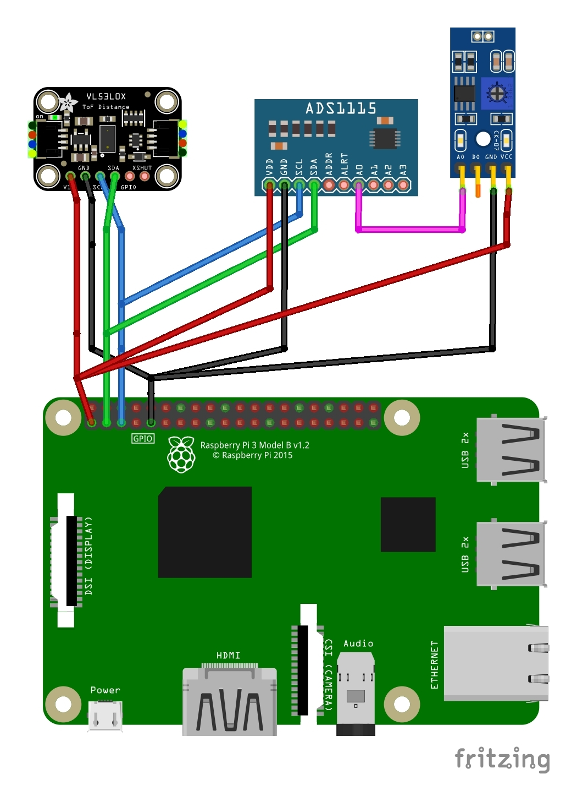

# Ricardo Tocha - Vaso

## Sensor Connections

components:
 - Raspberry Pi 3B
 - Raspberry Pi OS Bullseye 32bit
 - Distance Sensor VL53LXX
 - ADC module ADS1115 / ADS1015
 - LDR module MH sensor series



## Raspberry Configuration

install python  
```
sudo apt-get update
sudo apt-get -y upgrade
sudo apt-get install build-essential python-dev
sudo apt-get install --upgrade python3-setuptools
sudo apt-get install python3-pip
```

install blinka (CircuitPython for Linux)  
https://learn.adafruit.com/circuitpython-on-raspberrypi-linux/installing-circuitpython-on-raspberry-pi  
```
sudo pip3 install --upgrade adafruit-python-shell
wget https://raw.githubusercontent.com/adafruit/Raspberry-Pi-Installer-Scripts/master/raspi-blinka.py
sudo python3 raspi-blinka.py
```

after reboot, clone repo and test blinka  
```
git clone https://github.com/MILL-LX/tocha-vaso.git
cd tocha-vaso/
python3 sensores/blinkatest.py
```

install adafruit and OSC python libraries  
https://learn.adafruit.com/adafruit-vl53l0x-micro-lidar-distance-sensor-breakout/python-circuitpython  
https://learn.adafruit.com/adafruit-4-channel-adc-breakouts/python-circuitpython  
```
sudo pip3 install adafruit-circuitpython-vl53l0x adafruit-circuitpython-ads1x15 python-osc
```

install pure data and extensions for osc comms
```
sudo apt install -y puredata pd-mrpeach pd-mrpeach-net
```

install systemd services  
```
sudo cp vaso-sensores.service /etc/systemd/system/
sudo cp vaso-pd.service /etc/systemd/system/
sudo systemctl enable vaso-sensores.service
sudo systemctl enable vaso-pd.service
```